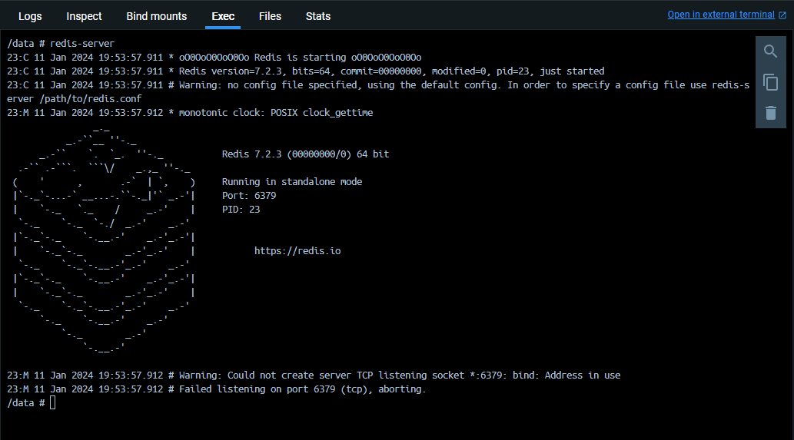

# REDIS DATABASE BY BXCODE


## INTRODUCCIÓN

1. [x] Redis es un almacén de estructuras de datos en memoria de código abierto.
2. [x] Se utiliza como base de datos, caché e intermediario de mensajes.
3. [x] Redis mantiene toda su base de datos en la memoria.
4. [x] El disco se utiliza para el almacenamiento persistente de datos.
5. [x] Es una base de datos NoSQL y sigue conceptos de almacén de valores clave.
6. [x] Admite estructuras de datos sólidas como cadenas, hashes, listas, conjuntos, conjuntos ordenados y mapas de bits.
7. [x] Redis se puede conectar con varios clientes.

## INSTALACIÓN SOBRE DOCKER

```yaml
version: '3.5'

services:

  redis-dev:
    container_name: redis-db
    image: redis:alpine3.18
    restart: always
    ports:
      - "6379:6379"
      - "8001:8001"
    volumes:
      - /volumes/redis:/data
    networks:
      - bacsystem

networks:
  bacsystem:
    driver: bridge
```

## MÁS INFORMACIÓN

```link
https://redis.io
```

```bash
$ redis-server
```



```bash
$ redis-cli
```

#### output

```bash
127.0.0.1:6379> 
```

```bash
$ ping "Hello"
```

```bash
$ quit
```

#### output

```bash
/data #
```

### Comandos Redis

```link
https://redis.io/commands/
```

### El almacenamiento de datos de Redis

- Redis es una estructura de datos basada en claves.
- Redis pertenece a la familia de bases de datos llamadas "Key-Values-stores".
- Un medio clave es una forma de almacenar y recuperar valores.

### SET

- Establece la clave para contener el valor de la cadena. Si la clave ya contiene un valor, se sobrescribe,
  independientemente de su tipo.
- Cualquiera es el tiempo de vida anterior asociado con la clave se descarta si la operación SET es exitosa.

  

### GET

- Obtiene el valor de la clave. Si la clave no existe, se devuelve el valor especial **nil**.
- Se devuelve un error si el valor almacenado en la clave no es una cadena, porque **GET** solo maneja valores de
  cadena.
- Devolver respuesta de cadena masiva: el valor de la clave, o nulo cuando la clave no existe.

  

```bash
$ set key value
$ get key
```

#### Ejemplo: más comandos.

```bash
# Set and Get Information
$ redis-cli
$ set dd1ceced-1754-486a-bf22-1161c6f92026 "Christian"
# OK
$ get dd1ceced-1754-486a-bf22-1161c6f92026
# "Christian"
# Delete key
$ del dd1ceced-1754-486a-bf22-1161c6f92026
# (integer) 1 
$ get dd1ceced-1754-486a-bf22-1161c6f92026
# (nil)
#  How to check if a key exists or not
$ exists dd1ceced-1754-486a-bf22-1161c6f92026
# (integer) 0
$ set dd1ceced-1754-486a-bf22-1161c6f92026 "Christian"
# OK
$ exists dd1ceced-1754-486a-bf22-1161c6f92026
# (integer) 1
```

### EXPIRAR (EXPIRE)

- Establezca un tiempo de espera en la tecla. Una vez transcurrido el tiempo de espera, la clave se eliminará
  automáticamente. Una clave con un asociado.
- A menudo se dice que el tiempo de espera es volátil en la terminología de Redis.

#### Example:

```bash
# How to define keys with expiration
# TTL 
# - The command returns -2 if the key does not exist.
# - The command returns -1 if the key exists but has no associated expire.
$ set dd1ceced-1754-486a-bf22-1161c6f92026 "Christian" ex 120
# OK
$ ttl dd1ceced-1754-486a-bf22-1161c6f92026
# (integer) 32
$ ttl dd1ceced-1754-486a-bf22-1161c6f92026
# (integer) -2
# Change expire
$ set dd1ceced-1754-486a-bf22-1161c6f92026 "Christian" ex 120
# OK
$ ttl dd1ceced-1754-486a-bf22-1161c6f92026
# (integer) 117
$ expire dd1ceced-1754-486a-bf22-1161c6f92026 10
# (integer) 1
$ ttl dd1ceced-1754-486a-bf22-1161c6f92026
# (integer) 8 
$ ttl dd1ceced-1754-486a-bf22-1161c6f92026
# (integer) -2
```

### PERSISTIR (PERSIST)

- Elimine el tiempo de espera existente en la clave, cambiando la clave de volátil (una clave con un conjunto caducado)
  a persistente (una clave que nunca caducará yá que no hay ningún tiempo de espera asociado).
- Devuelve una respuesta entera, específicamente:
    - 1 si se eliminó el tiempo de espera.
    - 0 si la clave no existe o no tiene un tiempo de espera asociado.

#### Example:

```bash
# How to remove expiration from a key
$ set dd1ceced-1754-486a-bf22-1161c6f92026 "Christian" ex 120
# OK
$ ttl dd1ceced-1754-486a-bf22-1161c6f92026
# (integer) 108
$ persist dd1ceced-1754-486a-bf22-1161c6f92026
# (integer) 1
$ ttl dd1ceced-1754-486a-bf22-1161c6f92026
# (integer) -1
```

```bash
# Key Spaces
$ set dd1ceced-1754-486a-bf22-1161c6f92026 "Christian"
# OK
$ get dd1ceced-1754-486a-bf22-1161c6f92026
# "Christian"
$ set dd1ceced-1754-486a-bf22-1161c6f92026 "David"
# OK
$ get dd1ceced-1754-486a-bf22-1161c6f92026
# "David" 
```

### SELECT

- Seleccione la base de datos lógica de Redis que tenga el índice numérico de base cero especificado. Las nuevas
  conexiones siempre utilizan el base de datos 0

#### Example:

```bash
127.0.0.1:6379> select 0
OK
127.0.0.1:6379> select 1
OK
127.0.0.1:6379[1]> 
```

### Conéctate a Redis

Aprenda a utilizar interfaces de usuario y bibliotecas cliente.
Puede conectarse a Redis de las siguientes maneras:

Con la redis-cli, herramienta de línea de comando
Utilice **[RedisInsight](https://redis.io/docs/connect/insight/)** como interfaz gráfica de usuario
A través de una biblioteca cliente para su lenguaje de programación

### Bibliotecas cliente

### PROJECT IN NODE JS USING REDIS:

```
# References
https://www.youtube.com/watch?v=vGkInLFL0kg
```
